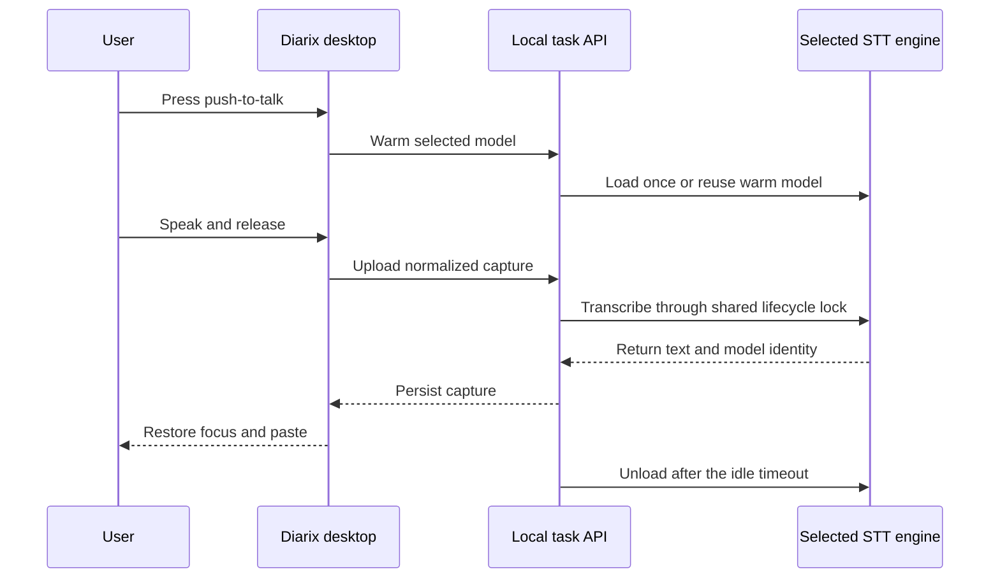
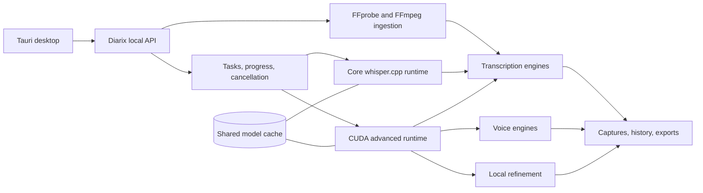

<p align="center">
  
</p>

<p align="center">
  <strong>Transcription-first. Local-first. One native studio.</strong><br />
  Turn audio, video, and live speech into useful text. Generate voices, refine drafts, and manage local models from the same app.
</p>

<p align="center">
  <a href="https://github.com/Yannam-Builds/Diarix/releases/tag/v0.1.0-alpha.1"></a>
</p>

<p align="center">
  <a href="https://github.com/Yannam-Builds/Diarix/actions/workflows/ci.yml"></a>
  <a href="LICENSE"></a>
  
  <a href="https://github.com/Yannam-Builds/Diarix/releases/tag/v0.1.0-alpha.1"></a>
</p>

<p align="center">
  <a href="#download-and-install">Install</a>&nbsp;&middot;&nbsp;
  <a href="#what-diarix-does">Product</a>&nbsp;&middot;&nbsp;
  <a href="#model-runtime">Models</a>&nbsp;&middot;&nbsp;
  <a href="#architecture">Architecture</a>&nbsp;&middot;&nbsp;
  <a href="#local-by-design">Local-first</a>&nbsp;&middot;&nbsp;
  <a href="#development">Development</a>
</p>

> [!WARNING]
> Diarix is pre-alpha software. The current release targets Windows 11 x64. Save important work outside the app and report reproducible problems through [GitHub Issues](https://github.com/Yannam-Builds/Diarix/issues).

## Download and install

The first public build is ready from the [Diarix v0.1.0-alpha.1 release](https://github.com/Yannam-Builds/Diarix/releases/tag/v0.1.0-alpha.1).

1. Download **`Diarix.Core.Setup.0.1.0-alpha.1.exe`** from the release page.
2. Run the installer. If Windows SmartScreen appears, choose **More info**, then **Run anyway**.
3. Open Diarix. The compact CPU runtime, FFmpeg, and FFprobe are already included.
4. Download transcription, voice, refinement, or CUDA components from inside the app when you need them.

The installer checks the Microsoft WebView2 and Visual C++ runtimes. If either dependency is missing, it opens the official Microsoft download page. Model weights are not bundled, and Diarix lets you choose where downloaded models and caches are stored.

| Download | Purpose |
|---|---|
| **Core Setup** | Desktop app, compact CPU server, media tools, and an empty model cache |
| **Whisper and other models** | Downloaded from the Models section into your selected storage location |
| **CUDA backend** | Optional NVIDIA acceleration, downloaded and assembled from verified release assets |

CPU and CUDA use the same library, task system, history, model catalog, and cache. Switching runtimes does not create another Diarix app or require a separately managed Python worker.

## What Diarix does

| Transcribe anything | Dictate anywhere | Keep the full studio |
|---|---|---|
| Drop audio or video, including MP4, onto the default dashboard. FFprobe inspects the source and FFmpeg creates model-ready audio without changing the original. | Use push-to-talk or toggle dictation from any app. Diarix restores focus, pastes the result, keeps the selected model warm while needed, and releases memory after the configured idle period. | Voice generation, profiles, stories, captures, history, local refinement, downloads, cancellation, and GPU controls stay separate but connected. |

<p align="center">
  
</p>

Diarix exposes the work behind a transcript instead of hiding it behind an indeterminate spinner. Media inspection, normalization, model loading, transcription, live partials, and persistence are distinct task stages with shared progress and cancellation.

### Built for local speech work

- Real task stages from media inspection through export
- Live partial transcript chunks when the selected engine exposes them
- Model-specific languages, precision, memory guidance, and audio normalization
- Shared downloads when multiple runtimes use the same checkpoint
- Silent bundled servers with no production terminal windows
- Local transcripts, audio, profiles, model weights, and generated voices
- User-selected model and cache locations

### Why Diarix

Most local speech tools solve one part of the workflow. Diarix brings batch transcription, system-wide dictation, model-aware media preparation, voice generation, refinement, history, and runtime management into one native desktop app. Start with the compact CPU runtime, then add CUDA without moving your library or cache.

## Model runtime

<p align="center">
  
  
  
</p>

Diarix uses one catalog and one cache across Whisper, Faster-Whisper, WhisperX, NVIDIA NeMo models, Qwen3-ASR, local TTS engines, and Qwen3 refinement. Runtime choices remain distinct where behavior differs. Duplicate checkpoints resolve to one physical weight group.

| Workload | Runtime families |
|---|---|
| Transcription | Whisper, Faster-Whisper, Distil-Whisper, WhisperX, NVIDIA Parakeet, NVIDIA Canary, Canary-Qwen, Qwen3-ASR |
| Voice | Qwen3-TTS, Qwen CustomVoice, LuxTTS, Chatterbox, TADA, Kokoro |
| Refinement | Local Qwen3 instruction models |
| Media | Central FFprobe inspection and FFmpeg normalization |

Model cards expose supported languages and runtime requirements. Diarix normalizes incoming media for the selected engine instead of asking users to convert files manually.

## Dictation lifecycle



An active transcription owns the model lifecycle. Switching model families releases the previous engine before loading the next one, which avoids the memory peak caused by holding both at once.

## Architecture



The Tauri process starts and owns the bundled server silently. The backend variants expose the same task, download, cancellation, cache, and history contracts.

## Local by design

<p align="center">
  
</p>

Core transcription, dictation, voice generation, and refinement run on the local runtime you select. An internet connection is needed to download the app, optional runtimes, and model files, but installed workflows do not depend on a cloud account or hosted inference service.

## Platform roadmap

The first alpha focuses on Windows 11 x64 so the CPU and NVIDIA CUDA paths can be hardened against one reproducible target. macOS and Linux are planned after the Windows installer, model lifecycle, and transcription correctness gates are stable. They are not supported release targets yet.

## Development

Contributor setup lives in [`docs/DEVELOPMENT.md`](docs/DEVELOPMENT.md). Read [`docs/ARCHITECTURE.md`](docs/ARCHITECTURE.md) for the runtime contract and [`docs/ALPHA_RELEASE.md`](docs/ALPHA_RELEASE.md) for the exact release gate.

```powershell
git clone https://github.com/Yannam-Builds/Diarix.git
cd Diarix
bun install --frozen-lockfile
bun run typecheck
bun run --cwd app build
```

Please read [`CONTRIBUTING.md`](CONTRIBUTING.md), [`SECURITY.md`](SECURITY.md), and [`RESPONSIBLE_USE.md`](RESPONSIBLE_USE.md) before opening a contribution or security report.

## Acknowledgements and license

Diarix is an independent fork of [Voicebox](https://github.com/jamiepine/voicebox), created by Jamie Pine and the Voicebox contributors. Thank you for the studio foundation, local task architecture, and permissive MIT-licensed starting point.

The lightweight push-to-talk workflow, warm model lifecycle, and practical offline dictation experience were strongly informed by [Handy](https://github.com/cjpais/Handy). Thank you to CJ Pais and the Handy contributors for raising the bar for local dictation software in the open.

Diarix preserves the upstream MIT license and adds transcription, media ingestion, runtime, dictation, desktop UX, and packaging work. Project code and third-party dependencies retain their respective licenses.

See [`LICENSE`](LICENSE) for the full license text.
