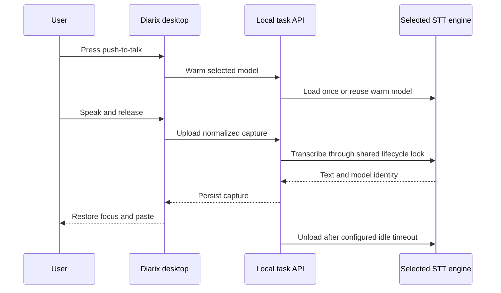
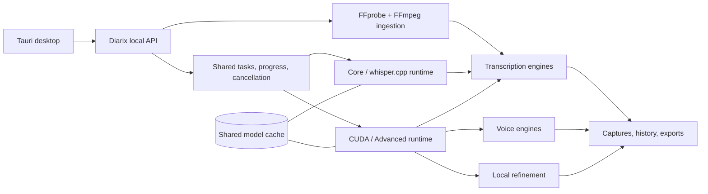

  

  <strong>Transcription-first. Local-first. One native studio.</strong> 
  Turn audio, video, and live speech into useful text—then generate voices, refine drafts, and manage every local model without leaving the app.

  
  
  
  

  <a href="#what-diarix-does">Product</a> ·
  <a href="#model-runtime">Models</a> ·
  <a href="#three-interchangeable-editions">Editions</a> ·
  <a href="#architecture">Architecture</a> ·
  <a href="#development">Development</a>

> **Alpha status:** Diarix is prerelease software. Windows x64 and the NVIDIA CUDA runtime are the first supported release targets; see [`docs/ALPHA_RELEASE.md`](docs/ALPHA_RELEASE.md) for the ship gate and known limitations.

## What Diarix does

| Transcribe anything | Dictate anywhere | Keep the full studio |
|---|---|---|
| Drop audio or video—including MP4—onto the default dashboard. FFprobe inspects the source and FFmpeg creates model-ready audio without touching the original. | Use push-to-talk or toggle dictation from any app. Diarix restores focus, pastes the result, warms the selected model while you speak, and releases VRAM after the chosen idle period. | Voice generation, profiles, stories, captures, history, local refinement, downloads, cancellation, and GPU controls remain separate but integrated sections. |

### Built around honest local work

- Real task stages from media inspection through export
- Live partial transcript chunks where the selected engine exposes them
- Model-specific languages, precision, memory guidance, and audio normalization
- Shared model downloads when multiple runtimes use the same checkpoint
- Silent bundled servers with no terminal windows in production
- Local transcripts, audio, profiles, model weights, and generated voices

### Why Diarix

Most local speech tools solve one part of the workflow. Diarix keeps batch transcription, system-wide dictation, model-aware media preparation, voice generation, refinement, history, and runtime management in one native desktop app. It stays useful with a compact CPU runtime and can grow into the CUDA backend without changing the user's library or cache.

## Model runtime

  
  
  

Diarix uses one catalog and one cache across standard Whisper, Faster-Whisper, WhisperX, NVIDIA NeMo models, Qwen3-ASR, local TTS engines, and Qwen3 refinement. Runtime choices stay distinct when their behavior differs, while duplicate checkpoint downloads collapse into one physical weight group.

| Workload | Current runtime families |
|---|---|
| Transcription | Whisper, Faster-Whisper, Distil-Whisper, WhisperX, NVIDIA Parakeet, NVIDIA Canary, Canary-Qwen, Qwen3-ASR |
| Voice | Qwen3-TTS, Qwen CustomVoice, LuxTTS, Chatterbox, TADA, Kokoro |
| Refinement | Local Qwen3 instruction models |
| Media | Central FFprobe inspection and FFmpeg normalization |

## Three interchangeable editions

Every edition uses the same data directory, task API, model catalog, cache, captures, profiles, and history. Moving between them must never duplicate or migrate user data.

| Edition | Ships with | Can add later |
|---|---|---|
| **Diarix Core** | Native desktop app, compact server, and an empty model cache | Starter models and CUDA/Advanced ASR |
| **Diarix + Whisper** | Core plus one compact GGUF starter model | CUDA/Advanced ASR and individual models |
| **Diarix Full CUDA** | Desktop app, compact fallback, and the complete CUDA-capable server | Any model from the in-app catalog |

## Dictation lifecycle

The model is never unloaded during an active transcription. Switching model families releases the previous engine before the next one loads, avoiding the peak memory cost of holding both at once.

## Architecture

The server is bundled and launched silently by Tauri. Diarix does not require a separately managed Python worker.

## Platform roadmap

The first alpha is intentionally Windows 11 x64 so the packaged CPU and NVIDIA CUDA paths can be hardened against one reproducible target. macOS and Linux are planned after the Windows installer, model lifecycle, and transcription correctness gates are stable; they are not yet supported release targets.

## Development

Contributor setup lives in [`docs/DEVELOPMENT.md`](docs/DEVELOPMENT.md). The architecture contract is
documented in [`docs/ARCHITECTURE.md`](docs/ARCHITECTURE.md), and the exact alpha checklist is in
[`docs/ALPHA_RELEASE.md`](docs/ALPHA_RELEASE.md).

## Acknowledgements and license

Diarix is an independent fork of [Voicebox](https://github.com/jamiepine/voicebox), created by Jamie Pine and the Voicebox contributors. Thank you to that project for the studio foundation, local task architecture, and permissive MIT-licensed starting point.

The lightweight push-to-talk workflow, model warm/unload lifecycle, and practical offline dictation experience were strongly informed by [Handy](https://github.com/cjpais/Handy). Thank you to CJ Pais and the Handy contributors for making that work openly available and raising the bar for local dictation software.

Diarix preserves the upstream MIT license and adds substantial transcription, media-ingestion, runtime, dictation, desktop UX, and packaging work. Project-specific implementations and third-party dependencies retain their respective licenses.

See [`LICENSE`](LICENSE), [`RESPONSIBLE_USE.md`](RESPONSIBLE_USE.md), and [`SECURITY.md`](SECURITY.md).
