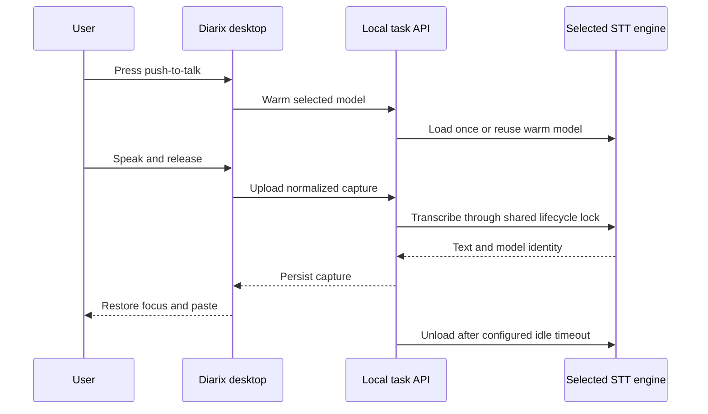
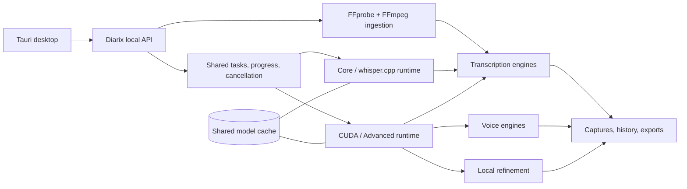

<p align="center">
  
</p>

<p align="center">
  
</p>

<p align="center">
  <strong>Transcription-first. Local-first. One native studio.</strong><br />
  Turn audio, video, and live speech into useful text—then generate voices, refine drafts, and manage every local model without leaving the app.
</p>

<p align="center">
  <a href="#what-diarix-does">Product</a> ·
  <a href="#model-runtime">Models</a> ·
  <a href="#three-interchangeable-editions">Editions</a> ·
  <a href="#architecture">Architecture</a> ·
  <a href="#development">Development</a>
</p>

> Diarix is in active development. The repository is private while runtime verification, packaging, and release hardening are completed.

## What Diarix does

| Transcribe anything | Dictate anywhere | Keep the full studio |
|---|---|---|
| Drop audio or video—including MP4—onto the default dashboard. FFprobe inspects the source and FFmpeg creates model-ready audio without touching the original. | Use push-to-talk or toggle dictation from any app. Diarix restores focus, pastes the result, warms the selected model while you speak, and releases VRAM after the chosen idle period. | Voice generation, profiles, stories, captures, history, local refinement, downloads, cancellation, and GPU controls remain separate but integrated sections. |

### Built around honest local work

- Real task stages from media inspection through export
- Live partial transcript chunks where the selected engine exposes them
- Model-specific languages, precision, memory guidance, and audio normalization
- Shared model downloads when multiple runtimes use the same checkpoint
- Silent bundled servers with no terminal windows in production
- Local transcripts, audio, profiles, model weights, and generated voices

## Model runtime

<p align="center">
  
  
  
</p>

Diarix uses one catalog and one cache across standard Whisper, Faster-Whisper, WhisperX, NVIDIA NeMo models, Qwen3-ASR, local TTS engines, and Qwen3 refinement. Runtime choices stay distinct when their behavior differs, while duplicate checkpoint downloads collapse into one physical weight group.

| Workload | Current runtime families |
|---|---|
| Transcription | Whisper, Faster-Whisper, Distil-Whisper, WhisperX, NVIDIA Parakeet, NVIDIA Canary, Canary-Qwen, Qwen3-ASR |
| Voice | Qwen3-TTS, Qwen CustomVoice, LuxTTS, Chatterbox, TADA, Kokoro |
| Refinement | Local Qwen3 instruction models |
| Media | Central FFprobe inspection and FFmpeg normalization |

## Three interchangeable editions

Every edition uses the same data directory, task API, model catalog, cache, captures, profiles, and history. Moving between them must never duplicate or migrate user data.

| Edition | Ships with | Can add later |
|---|---|---|
| **Diarix** | Native desktop app and lightweight core | whisper.cpp and CUDA/Advanced ASR servers |
| **Diarix + whisper.cpp** | Desktop app plus compact local transcription | CUDA/Advanced ASR and individual models |
| **Diarix Full** | Desktop app plus the complete CUDA-capable model server | Any model from the in-app catalog |

## Dictation lifecycle



The model is never unloaded during an active transcription. Switching model families releases the previous engine before the next one loads, avoiding the peak memory cost of holding both at once.

## Architecture



The server is bundled and launched silently by Tauri. Diarix does not require a separately managed Python worker.

## Development

### Requirements

- Windows 11 for the current CUDA-focused build
- Bun
- Rust and Tauri prerequisites
- Python 3.11 or 3.12 for backend development
- FFmpeg and FFprobe when running outside the packaged server

### Desktop app

```powershell
cd tauri
bun install
bun run tauri dev
```

### Backend tests

```powershell
backend\venv\Scripts\python.exe -m pytest backend\tests -q
```

Packaging scripts live in [`installer/`](installer/) and [`scripts/`](scripts/). Model weights, application caches, build logs, virtual environments, and packaged binaries are intentionally excluded from source control.

## Current release work

- Complete real-inference verification across ASR, Whisper, TTS, and refinement
- Compare model output quality on shared fixtures
- Verify live chunks, progress, cancellation, idle unload, and safe model switching
- Produce base, whisper.cpp, and full CUDA installers
- Validate silent startup and backend interchangeability in the real Tauri app

## Upstream and license

Diarix is an independent fork of [Voicebox](https://github.com/jamiepine/voicebox), created by Jamie Pine and the Voicebox contributors. It preserves the upstream MIT license and adds substantial transcription, media-ingestion, runtime, dictation, desktop UX, and packaging work.

See [`LICENSE`](LICENSE), [`RESPONSIBLE_USE.md`](RESPONSIBLE_USE.md), and [`SECURITY.md`](SECURITY.md).
