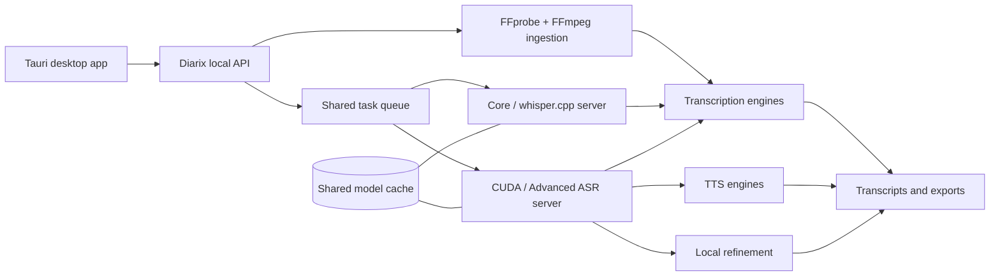

<p align="center">
  
</p>

<h1 align="center">Diarix</h1>

<p align="center">
  <strong>A transcription-first, local AI speech studio.</strong><br />
  Transcribe audio and video, generate voices, refine text, and manage local models from one native desktop app.
</p>

<p align="center">
  
  
  
  
</p>

---

Diarix turns local audio and video into useful text without splitting the workflow across separate apps or workers. Transcription is the default workspace; Voicebox-style TTS, profiles, stories, history, model management, and refinement remain integrated as focused sections of the same application.

> Diarix is under active development. Installers and signed releases are not published yet.

## What makes Diarix different

| | |
|---|---|
| **Transcription first** | Drop audio or video directly onto the dashboard, choose a model, and follow the real task state from media inspection through export. |
| **Local model choice** | Standard Whisper, Faster-Whisper, WhisperX, NVIDIA NeMo models, Qwen3-ASR, and local Qwen refinement share one catalog and cache. |
| **Real media ingestion** | FFprobe inspects every source and FFmpeg normalizes audio to the exact sample rate, channel layout, codec, and container required by the selected model. |
| **One task architecture** | Downloads, generation, transcription, progress, cancellation, caching, and GPU lifecycle use the same native server architecture. |
| **Speech in both directions** | Keep transcription, dictation, voice cloning, preset voices, TTS generation, stories, and history in one workstation. |
| **Private by default** | Media, transcripts, profiles, model weights, and generated speech remain on the user's machine. |

## Desktop workspace

```text
Transcription       Audio/video → normalized media → live transcript → TXT/SRT/VTT/JSON
Voice generation    Profiles → local TTS engine → generated audio → versions/effects
Captures            Dictation and imported recordings → raw/refined searchable text
Stories             Multi-voice composition and timeline workflows
Models              Shared downloads, readiness, progress, unload, and deletion
Settings            Storage, resource controls, GPU backend, logs, and application state
```

## Runtime editions

Diarix is being packaged as three interchangeable editions. They use the same application data, model catalog, task APIs, and project files.

| Edition | Included | Optional later |
|---|---|---|
| **Diarix** | Desktop app and lightweight core server | whisper.cpp server or CUDA server |
| **Diarix + whisper.cpp** | Desktop app plus a compact local transcription backend | CUDA/Advanced ASR runtime and additional models |
| **Diarix Full** | Desktop app plus the complete CUDA-capable model server | Individual model downloads through the app |

Changing editions must not migrate or duplicate user data. A downloaded model should be recognized by every compatible server, and models that share the same Hugging Face repository should share one physical cache entry.

## Transcription engines

The catalog currently covers:

- OpenAI Whisper: Base, Small, Medium, Large v3, and Large v3 Turbo
- Distil-Whisper and Faster-Whisper variants
- WhisperX with aligned timestamps
- NVIDIA Parakeet and Canary families through NeMo
- NVIDIA Canary-Qwen
- Qwen3-ASR

Model-specific languages, precision choices, memory guidance, and normalized audio requirements are declared in the backend registry and surfaced by the app.

## Voice and refinement engines

- Qwen3-TTS Base and CustomVoice
- LuxTTS
- Chatterbox Multilingual and Chatterbox Turbo
- HumeAI TADA
- Kokoro
- Qwen3 local refinement models

## Architecture



The server is bundled and launched silently by Tauri. Diarix does not require a separately managed Python worker or a visible terminal window.

## Development

### Requirements

- Windows 11 for the current CUDA-focused build
- Bun
- Rust and the Tauri prerequisites
- Python 3.11/3.12 for backend development
- FFmpeg and FFprobe when running outside the packaged server

### Run the desktop app

```powershell
cd tauri
bun install
bun run tauri dev
```

### Run backend tests

```powershell
backend\venv\Scripts\python.exe -m pytest backend\tests -q
```

Build and packaging scripts live in [`installer/`](installer/) and [`scripts/`](scripts/). Model weights, application caches, build logs, virtual environments, and packaged binaries are intentionally excluded from source control.

## Current focus

- Complete real-inference verification across ASR, Whisper, TTS, and refinement engines
- Prove live partial transcript chunks and honest progress in the desktop UI
- Deduplicate catalog entries that share model weights
- Produce interchangeable base, whisper.cpp, and full CUDA installers
- Validate silent startup, cancellation, cache cleanup, and backend switching end to end

## Upstream and license

Diarix is an independent fork of [Voicebox](https://github.com/jamiepine/voicebox), created by Jamie Pine and the Voicebox contributors. The project preserves the upstream MIT license and includes substantial Diarix-specific work in transcription, media ingestion, model runtimes, desktop UX, and packaging.

See [`LICENSE`](LICENSE), [`RESPONSIBLE_USE.md`](RESPONSIBLE_USE.md), and [`SECURITY.md`](SECURITY.md).
