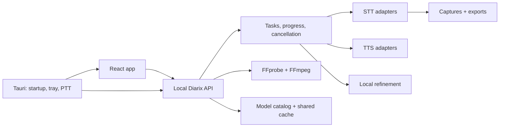

# Architecture

Diarix is one native desktop application with one local backend contract. CPU, native Whisper, and
CUDA distributions are interchangeable runtime packages—not separate apps.

## Source map

| Path | Responsibility |
|---|---|
| `app/` | Product UI, typed API client, transcription dashboard, history and settings |
| `backend/` | API, media ingestion, models, downloads, inference, tasks and persistence |
| `tauri/` | Native lifecycle, sidecar selection, audio capture, global shortcuts and tray |
| `installer/` | Windows payload assembly and Inno Setup packaging |
| `scripts/` | Cross-workspace verification, code generation and release utilities |

## Invariants

- Every imported media file is inspected centrally and normalized to the selected adapter's declared
  input contract.
- The task queue owns long-running inference state; UI state is recoverable from the backend.
- Cancellation is cooperative inside chunked runtimes and always converges to model cleanup.
- Download state comes from physical cache inspection, including shared checkpoints.
- Production startup never depends on Vite, Codex, a visible console, or a separately launched
  Python process.
